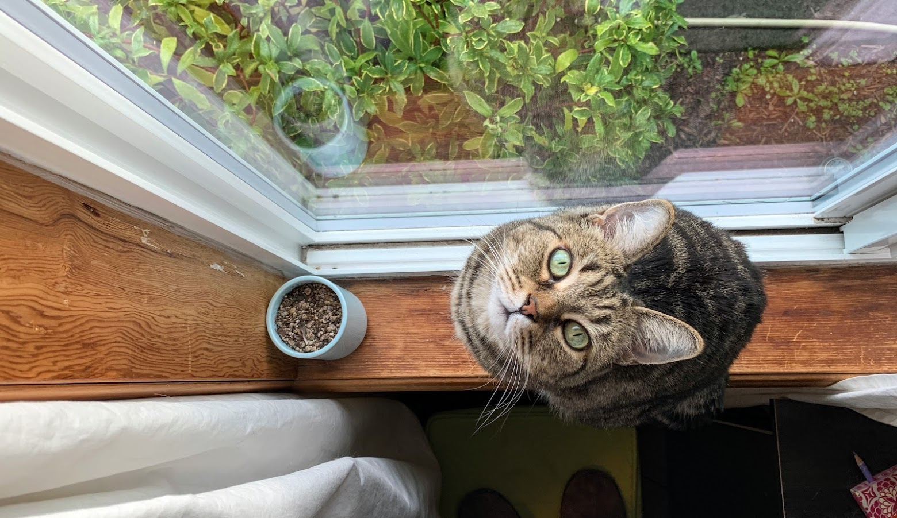

# Introduction
My name is **Amanda Klehr**. I typically go by **Mandy**, but I answer to both!  

My spouse and I just moved to Amherst from Portland, Oregon. I miss Portland a lot, but I am really excited about continuing to pursue my *Master of Science* within the Department of Environmental Conservation in wildlife, fish and conservation biology. 

I started virtually in Spring 2021 and I really appreciate the chance to be on campus and interact with my professors and cohorts in-person this semester. Obviously, I love cats and I have one super cuddly, 11-year old cat named Deirdre Daffodil Pottendorf, or DeeDee for short.      

# Concepts List
The things I would like to gain from this course include the following: 

1. R basics and techniques
2. Exploring different packages in R to use for modeling my data (e.g., using for N-Mixture Models)
3. Using R Markdown to create documents like this one and presentations, etc. to design and communicate my results in a user-friendly manner
4. I like visuals and am also excited to learn more about creating tables and figures in R as well

# Course List

All of the courses I have taken at UMass so far have been great! Including: 

* Introduction to GIS 
* Offshore Wind Energy: Environmental Impacts, Siting, Permitting, and Stakeholder Engagement (wow - that's a mouthful!)  
* Clean Energy and Climate Change Policy in the Commonwealth of Massachusetts (also, quite the course title)
* Analysis of Environmental Data: lecture and lab (foundational and so thrilled to be here!)

Also a shout out to a few courses from my undergrad at Portland State University (more than 10 years ago - eek!) that were stellar and are really the reason I am here today: 

* Vertebrate Zoology
* Ornithology
* Marine Mammalogy (and all of the other courses related to marine mammals I took from Dr. Deb Duffield )

(You can tell I'm a wildlife person...)

# Bonus: DeeDee

Here is a cute image of DeeDee!

