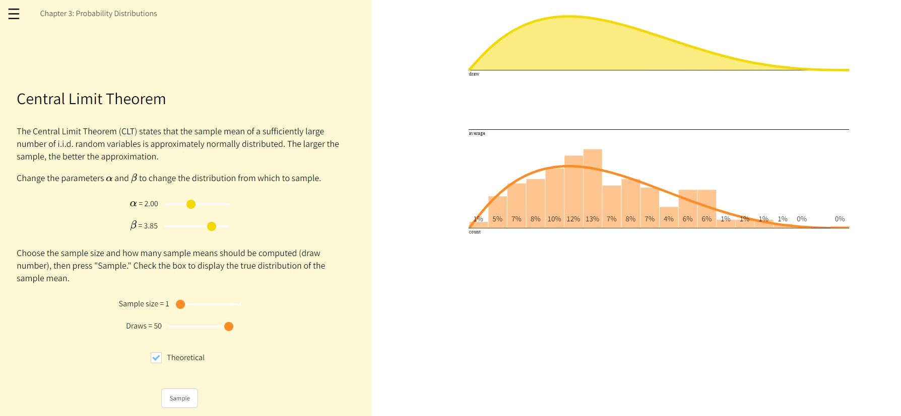
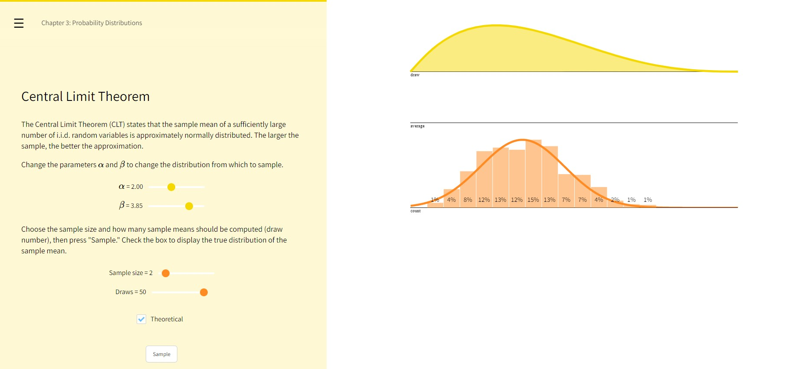
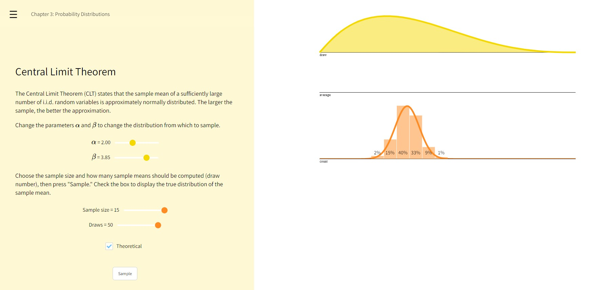

```{r,echo=FALSE, message=FALSE, results=FALSE, warning = FALSE, fig.show = 'hide'}


pnorm(7.5, mean = 10, sd = 3)
1 - pnorm(7.5, mean = 10, sd = 3)

```
# Q1

0.421875 or 42%

```{r}
dbinom(3, 4, 0.75)
```

# Q2

0.6835937 or 68%

```{r}
pbinom(3, 4, 0.75)

```

# Q3

0.6328125 or 63%

```{r}
1 - pbinom(3, 5, 0.75)
```

# Q4

0.3445783 or 34%

```{r}
pnorm(1.2, 2, 2)
```

# Q5

0.6554217 or ~66%

```{r}
1 - pnorm(1.2, 2, 2)
```

# Q6

0.3811686 or 38%

```{r}
pnorm(3.2, 2, 2) - pnorm(1.2, 2, 2)
```

# Q7

As I continue to press the sample button with sample size = 1 and draws = 50 with a left-skewed beta distribution, the histogram shifts to roughly match the skewed distribution. Because of the sample size of one, it takes many replications (draws) to resemble the left skewed beta distribution, but it appears the sampling distribution will never resemble a normal distribution.   




# Q8 

The histogram of the sampling distribution begins to resemble a normal distribution, but because of the parameters of the beta distribution, samples are off to the left of the histogram. This highlights concepts of the Central Limit Theorem in that the sampling distribution of the sample means will approach a normal distribution as the sample size increases (from 1 in the previous example to 2 in this one, and as we continue to press the sample button in the interactive visualization).



# Q9 

The sampling distribution is much more narrow, and pressing the sample button several times appears to distribute the sampled means from the beta distribution between just a few values within the center of the distribution. So there are a few bars in the histogram with the majority of the distribution, e.g., >20%.  




# Q10

Increasing the sample size from 1 to 2 also increases the number of times that the means are sampled (e.g., the number of draws), therefore, with 2 we get 100 samples of the beta distribution with one click, but with 1 it is only 50 draws. Also, increasing sample size affects the distribution and a sample size of 1 is just that, and will not approach a normal distribution.     

# Q11

Sample size and the sample standard deviation.

# Q12

25 x 25 x 25 = 25^3^ = 15,625

# Q13

B x 25^1^ which is 25^1,312,001^ possible books
This essentially adds one exponent to the value of B, which is adding one position to the book size. 


