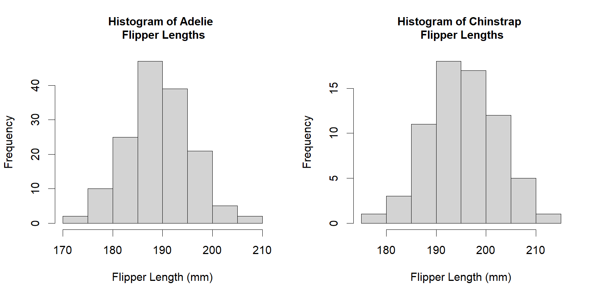

```{r, echo = FALSE}
#head(dat_catrate)

#summary(dat_catrate)
```


# Q1

```{r catrate}
require(here)

dat_catrate = read.csv(here("data", "catrate.csv"))

hist(dat_catrate$cat.rate, 
     main = "Histogram of Marbled Salamanader \n Catastrophe Rates",
     xlab = "Catasrophe Rate")
```

# Q2

The p-value of the Shapiro-Wilk test is 0.04097

```{r }
shapiro.test(dat_catrate$cat.rate)

```
# Q3

The null hypothesis of the Shapiro-Wilk test is that the catastrophe rates of the salamander data are normally distributed. 

# Q4

The p-value of 0.04097 provides strong evidence that we can reject the null hypothesis, therefore, it is likely our sample came from a non-normally distributed population.


# Q5

```{r}
t.test(dat_catrate$cat.rate, mu = 2 / 7)
```
# Q6

The mean of the catastrophe rate is equal to the value of the late-filling rate of approximately 0.28. This tells us that if our test does not show strong evidence that this statement is incorrect, then there is likely not a difference between the catastrophe rate and the lat-filling rate, and it is likely that there is no association between the two, e.g., that the rate at which vernal pools fill later in the season does not influence the reproductive catastrophe of marbled salamanders.   


# Q7

Two-tailed which is the default of *t.test()*. In order to get a one-tailed result, we would have to change **alternative** within the t.test function to either *greater* or *less* to define whether we are testing the mean to be greater than or less than the value of mu. 


# Q8

The p-value is 0.01193. This p-value as a false-positive rate means that 1% of the time, or for every 1/100 samples, we are willing to accept that the null hypothesis is true, and that there was a sampling error which made something within the population look like it was "interesting" or meaningful even if it was not


# Q9 

0.3526250 0.7261295, this confidence interval does not include zero.


# Q10

The resulting p-value of 0.01193 from the t.test provides strong evidence that we can reject the null hypothesis, therefore, it is likely that the mean of our sampled catastrophe rates is not equal to the late-filling rate.  

```{r, echo = FALSE, results = FALSE}
t.test(dat_catrate$cat.rate, mu = 2/7, alternative = "greater")
t.test(dat_catrate$cat.rate, mu = 2/7, alternative = "less")
```

# Q11

```{r}
wilcox.test(dat_catrate$cat.rate, mu = 2 / 7)
```

# Q12

t.test p-value = 0.01193
wilcox.test p-value = 0.006275


# Q13

The resulting p-value of 0.006275 from the Wilcoxon ranked sums test provides strong evidence that we can reject the null hypothesis, therefore, it is likely that the mean of our sampled catastrophe rates is not equal to the late-filling rate. 


# Q14

The results of both tests provide evidence that we can reject the null hypothesis. Which I think in terms of the relationship between these variables means we can reasonably conclude that the reproductive catastrophe is influenced by the late-filling of vernal pools.


# Q15

I think the Wilcoxon rank sum test was more appropriate for these data because it has a much lower p-value which we could consider as a smaller false-positive rate as well, meaning there is less sample error. Additionally, because our Shapiro Test indicated that we may have a small sample from a non-normal distribution and the Wilcoxon rank sum test is a more appropriate test for those kind of data.


# Q16

```{r}
require(palmerpenguins)

penguin_dat = droplevels(subset(penguins, species != "Gentoo"))

dat_adelie = subset(penguins, species == "Adelie")
shapiro.test(dat_adelie$flipper_length_mm)


dat_chinstrap = subset(penguins, species == "Chinstrap")
shapiro.test(dat_chinstrap$flipper_length_mm)

```

# Q17

The p-values of the Shapiro-Wilk test are high, both are well above 0.05, therefore, we can conclude that flipper lengths of Adelie and Chinstrap penguins are normally-distributed.


# Q18

```{r}
png(
    filename = here("images", "Penguins_Flipper_Lengths.png"),
    width = 1600, height = 800,
    res = 180)

par(mfrow = c(1, 2))
hist(dat_adelie$flipper_length_mm, 
     main = "Histogram of Adelie \n Flipper Lengths",
     xlab = "Flipper Length (mm)", 
     cex.main = 1.0)
hist(dat_chinstrap$flipper_length_mm, 
     main = "Histogram of Chinstrap \n Flipper Lengths",
     xlab = "Flipper Length (mm)", 
     cex.main = 1.0)

#typed the following in R Notebook below to add image that was created above to this report:
#
```


# Q19

The mean flipper length is different between Adelie and Chinstrap penguins. Because this was not directional (was a two-tailed test), it was not testing whether mean flipper lengths of Adelie penguins was greater than or less than Chinstrap penguins, but simply testing whether there is a difference in means between the two species.   


# Q20


```{r}
t.test(dat_adelie$flipper_length_mm, dat_chinstrap$flipper_length_mm)

```

