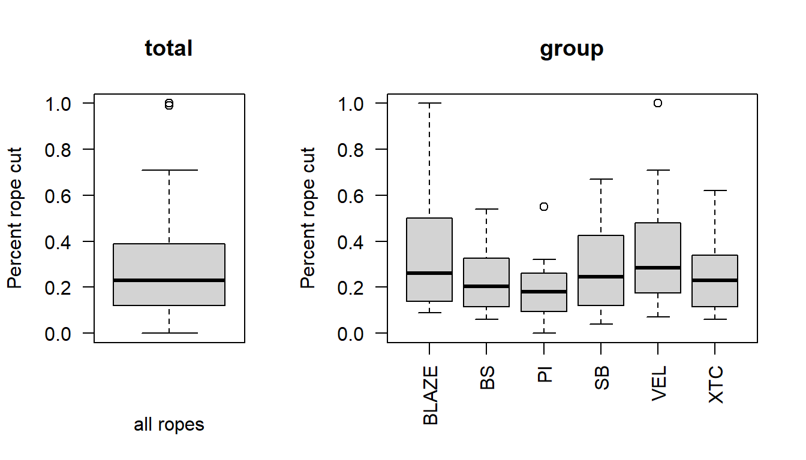

# Q1

```{r ANOVA by hand}
rm(list = ls())

require(here)

rope = read.csv(here("data", "rope.csv"))

rope$rope.type = factor(rope$rope.type)

n_obs = nrow(rope)
n_groups = length(levels(rope$rope.type))

ss_tot = sum((rope$p.cut - mean(rope$p.cut))^2)
df_tot = n_obs - 1

#agg_resids = aggregate(
  #x = rope$p.cut,
  #by = list(rope$rope.type),
  #FUN = function(x) x - mean(x))
#str(agg_resids)

agg_sq_resids = aggregate(
  x = rope$p.cut, 
  by = list(rope$rope.type),
  FUN = function(x) sum(x^2 - mean(x)^2))

#str(agg_sq_resids)
#Note: I had some issues with the agg_sq_resids when adding the sq. rt to the whole sum function, e.g., "sum(x - mean(x))^2. So I added the sq. rt to both the x and mean(x) instead. 
  
ss_within = sum(agg_sq_resids$x)
df_within = n_obs - n_groups

ss_among = ss_tot - ss_within
df_among = n_groups - 1

ms_within = ss_within / (n_obs - n_groups)
ms_among  = ss_among / (n_groups - 1)

f_ratio = ms_among / ms_within
f_pval = 1 - pf(f_ratio, df_among, df_within)

```


```{r code to be tested against}
# number comparison tolerance
digits_check = 5

# Build the reference model using R functions
fit_1 = lm(p.cut ~ rope.type, data=rope)
anova(fit_1)
anova_fit_1 = anova(fit_1)

# Check degrees of freedom
anova_fit_1$Df == c(df_among, df_within)

# Check sums of squares
round(anova_fit_1$`Sum Sq`, digits = digits_check) == round(c(ss_among, ss_within), digits = digits_check)

# Check mean squares
round(anova_fit_1$`Mean Sq`, digits = digits_check) == round(c(ms_among, ms_within), digits = digits_check)

# Check the F-ratio
round(anova_fit_1$`F value`[1], digits = digits_check) == round(f_ratio, digits = digits_check)

# Check the F test statistic p-value
round(anova_fit_1$`Pr(>F)`[1], digits = digits_check) == round(f_pval, digits = digits_check)
```

# Q2

Based on the boxplot, it appears that the variances are not equal among groups. The sizes of the boxes vary and even though the median values of the percent rope cut for each rope type are close to the same, there is a lot of variance between the lengths of the whiskers of each of the rope types. Additionally, the PI and VEL rope types have some outliers. 

 

# Q3

The p-value for the Bartlett test is 0.00143. 

```{r}
bartlett.test(p.cut ~ rope.type, data = rope)
```

# Q4

My above interpretation of the boxplots identified that there may not be homogeneity of the variances across the different rope types, and the p-value of our Bartlett's test is lower than 0.05 (0.00143) which also indicates that it is likely that we can reject the null hypothesis that variances are equal. Because the boxplot and the Bartlett's test seem to indicate that the homogenity assumption of an ANOVA-type analysis may have been violated, it may not be appropriate to use such an analysis on the these raw data.    


# Q5

BLAZE is the base case.

# Q6 

Because the rope type variables are categorical, the dummy variable in the coefficient table for the intercept is the mean percent cut for the base case rope type (BLAZE), which is 0.36714. 

# Q7

The mean percent cut for the XTC rope type is 0.2655 which is calculated as 0.36714-0.10164. 